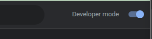
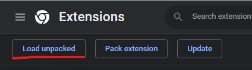
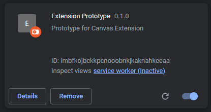
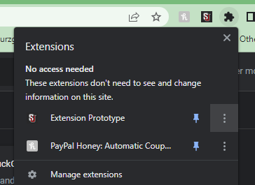

# Canvas Chrome Extension

## Developer Extension Installation Instructions

This is a Chrome extension only.

1. Download the repo
2. To install the extension, open chrome and go to [chrome://extensions/](chrome://extensions/).
3. On the extension page in the top right, toggle the developer mode on
    
4. Click "load unpacked" button in the upper left hand side of the screen.
     
5. Go to the directory where you saved the repo and navigate to **Canvas-Code > frontend > canvas-chrome-ext > dist**
   and click *Select Folder*.
6. The extension will appear on the extension page as *Canvas Code Grader*.   
   
If for some reason you get an error saying manifest.json can't be found make sure you're selecting the correct folder
containing the manifest.json file. Extensions are loaded by using this file in chrome.

### Additional notes

1. To make the extension appear as an icon in chrome, click the extension icon in the top right of the browser and pin
   the extension.  
2. When making changes to the extension you will have to go to the extensions page and hit the "update" button in the
   top left of window after each iteration.
3. To debug the extension right-click the window and hit inspect page and then select console. There should be messages
   that appear during usage of the extension.
4. Other extensions may influence the use of this extension things like adblockers, video playback speed extensions, and
   others may causes unknown errors. To remedy this turn off other extensions if you believe they are interfering with
   the program.
